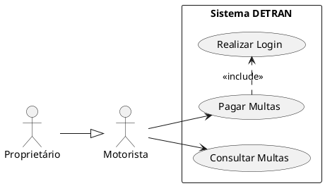

import Callout from "../../components/Callout.astro";
import SlidesGrid from "../../components/SlidesGrid.astro";
import SlideItem from "../../components/SlideItem.astro";

<SlidesGrid>
  <SlideItem src="/assets/img/slides/erp_06.webp" alt="O Blueprint da Interação: Modelando com Casos de Uso — Ator, Caso de Uso, Fronteira do Sistema, exemplo DETRAN" caption="O DCU comunica as funcionalidades do sistema em alto nível: quem usa (Ator), o que faz (Caso de Uso) e os limites do sistema (Fronteira)" />
  <SlideItem src="/assets/img/slides/erp_07.webp" alt="Estruturando a Lógica: Relacionamentos em Casos de Uso — Associação, Include, Extend e Generalização com exemplos" caption="Os quatro tipos de relacionamento no DCU: Associação, Include, Extend e Generalização" />
</SlidesGrid>

### O que é um Caso de Uso

Um Caso de Uso (CU) descreve uma **sequência de ações que o sistema executa para produzir um resultado de valor observável para um ator**. Define o "o quê", não o "como" — o comportamento funcional, não a implementação.

**Não confundir:**
- Caso de Uso ≠ Função do sistema (CU é orientado ao valor para o ator, não à lógica interna)
- Caso de Uso ≠ Tela (um CU pode envolver múltiplas telas)
- Caso de Uso ≠ Processo de negócio (CU é uma interação com o sistema; processo é mais amplo)

**Nomes de CUs:** sempre no infinitivo, orientados à ação do ator:
- ✅ "Consultar Multas", "Emitir Boleto", "Registrar Ocorrência"
- ❌ "Multas", "Processamento de Boleto", "Sistema de Ocorrências"

### O Diagrama de Caso de Uso

O DCU é um diagrama UML que apresenta **visão de alto nível** das funcionalidades do sistema e seus usuários.

**Três elementos fundamentais:**

| Elemento | Notação | Descrição |
|---|---|---|
| **Ator** | Stickman (boneco) | Papel desempenhado por usuário, sistema externo ou hardware que interage com o sistema |
| **Caso de Uso** | Elipse | Uma funcionalidade que o sistema oferece ao ator |
| **Fronteira do Sistema** | Retângulo | Delimita o que está dentro e fora do escopo do sistema |

**Tipos de atores:**

| Tipo | Descrição | Exemplo |
|---|---|---|
| Ator primário | Inicia o CU; tem a necessidade principal | Motorista |
| Ator secundário | Suporta ou participa do CU | Sistema bancário |
| Ator de sistema | Sistema externo que interage automaticamente | Receita Federal |

### Os quatro tipos de relacionamento

**1. Associação**

A relação básica entre um ator e um caso de uso — indica que o ator participa desse CU.

```
Motorista ————— Consultar Multas
```

**2. Include (`<<include>>`)**

Um CU base **obrigatoriamente inclui** outro CU. Use quando há comportamento comum reutilizado por múltiplos CUs — evita duplicação.

```
Pagar IPVA ----<<include>>---→ Realizar Login
Consultar Multas ----<<include>>---→ Realizar Login
```

> Direção da seta: CU base → CU incluído. Se o CU incluído não existir, o CU base não funciona.

**3. Extend (`<<extend>>`)**

Um CU **opcionalmente estende** outro CU em um ponto de extensão específico. Use para comportamentos condicionais que ocorrem apenas em certas circunstâncias.

```
Pagar com Cartão ----<<extend>>---→ Pagar Multas
Pagar com Boleto ----<<extend>>---→ Pagar Multas
```

> Direção da seta: CU extensor → CU base. O CU base funciona sem a extensão.

**4. Generalização**

Um ator ou CU filho **herda** o comportamento do pai e pode ter comportamentos adicionais.

```
       Usuário
      ↑       ↑
Motorista  Proprietário
```

### Include vs. Extend — diferença prática

| Aspecto | Include | Extend |
|---|---|---|
| Execução | **Sempre** — obrigatória | **Condicional** — só em certas situações |
| Dependência | CU base depende do incluído | CU base funciona sem o extensor |
| Direção da seta | Base → Incluído | Extensor → Base |
| Exemplo | Todo CU protegido inclui "Realizar Login" | "Aplicar Desconto" estende "Finalizar Compra" (só para clientes VIP) |

### Exemplo: sistema DETRAN

```
┌─────────────────────────────────────────────────────┐
│                   Sistema DETRAN                     │
│                                                      │
│    (Consultar Multas)    (Agendar Exame)             │
│    (Pagar IPVA)          (Recorrer de Multa)         │
│    (Realizar Login)                                   │
│    (Pagar Multas)                                    │
└─────────────────────────────────────────────────────┘
       ↑ Motorista    ↑ Proprietário    ↑ Agente de Trânsito
```

Relacionamentos:
- Motorista → Consultar Multas (associação)
- Pagar Multas `<<include>>` Realizar Login
- Pagar com Cartão `<<extend>>` Pagar Multas
- Proprietário herda de Motorista (generalização — pode tudo que motorista pode + mais)

<Callout type="warning">
**CUs que descrevem "o como" são erros comuns**

"Clicar no botão Salvar", "Abrir tela de cadastro" e "Preencher formulário" não são casos de uso — são passos de interface. CUs descrevem objetivos do usuário, não ações em botões. "Cadastrar Produto" é um caso de uso; "Clicar em Cadastrar" é um passo dentro da especificação do CU.
</Callout>

### Boas práticas para o DCU

- Mantenha o DCU em nível de abstração adequado — entre 5 e 20 CUs por sistema é saudável
- Organize CUs por grupos funcionais (agrupamento visual com caixas)
- Ator primário à esquerda; ator secundário à direita (convenção)
- Não use include para sequenciamento (para isso existe o Diagrama de Atividades)
- Todo CU deve ser rastreável a pelo menos um RF

### Práticas Modernas

**User Story Mapping** (Jeff Patton) — alternativa visual ao DCU em contextos ágeis. Organiza histórias de usuário em uma matriz: jornada do usuário na horizontal × prioridade na vertical. Mais intuitivo para stakeholders não técnicos.

**PlantUML para DCU versionável:**



#### Referências bibliográficas desta UA

- LEDUR, C. L. *Análise e Projeto de Sistemas*. Porto Alegre: SAGAH, 2017.
