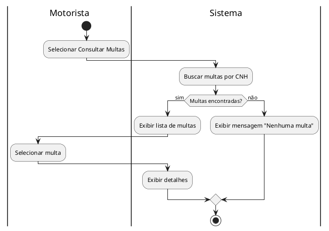
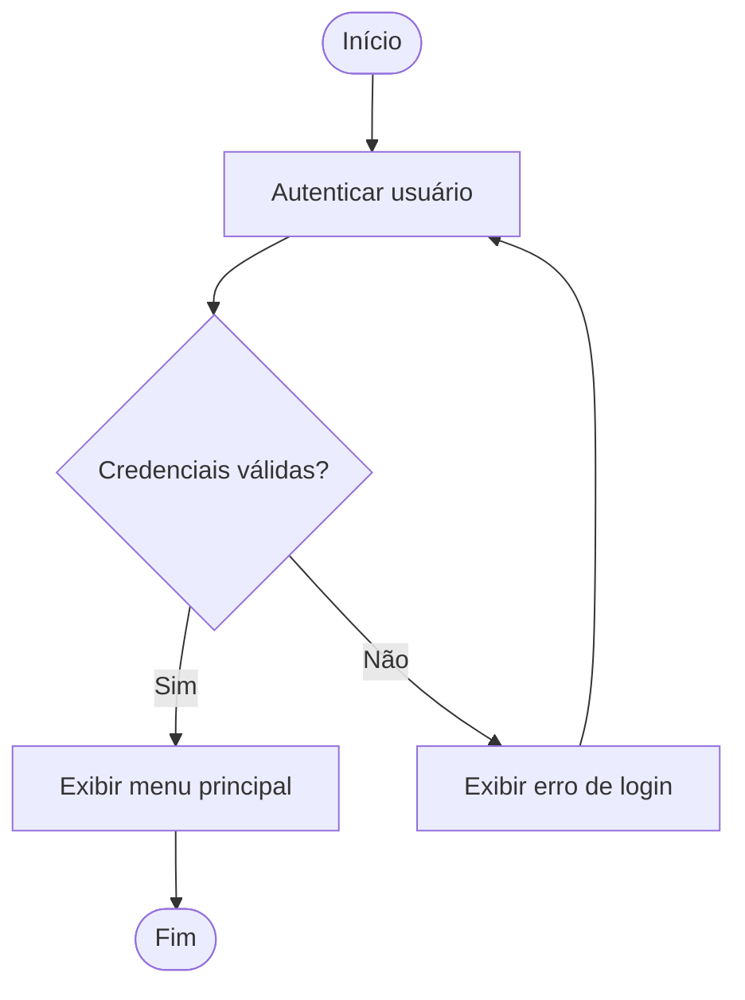

import Callout from "../../components/Callout.astro";
import SlidesGrid from "../../components/SlidesGrid.astro";
import SlideItem from "../../components/SlideItem.astro";
import InlineImage from "../../components/InlineImage.astro";

### O que é o Diagrama de Atividades

O Diagrama de Atividades (DA) é um diagrama **comportamental** da UML que modela **o fluxo de execução** de um processo, algoritmo ou sistema. É visualmente semelhante a um fluxograma, mas com semântica UML formal e elementos adicionais para modelar paralelismo e responsabilidades.

**Usos principais do DA:**
- Detalhar o fluxo interno de um Caso de Uso
- Modelar um processo de negócio (alternativa ao BPMN)
- Documentar algoritmos complexos
- Ilustrar fluxos de dados e decisões para stakeholders
- Criar documentação de APIs (fluxo de autenticação, fluxo de checkout)

### DA vs. DCU vs. Fluxograma

| | DCU | DA | Fluxograma |
|---|---|---|---|
| **Responde** | O que o sistema faz? | Como as atividades fluem? | Qual é a sequência de passos? |
| **Nível** | Alto — funcionalidades | Médio — fluxo de execução | Variável |
| **Paralelismo** | Não | Sim (fork/join) | Não (normalmente) |
| **Responsabilidades** | Atores externos | Swimlanes (raias) | Não formalmente |
| **Padrão** | UML | UML | Informal |

### Elementos do Diagrama de Atividades

| Elemento | Notação | Significado |
|---|---|---|
| **Nó inicial** | Círculo sólido preenchido (●) | Ponto de início do fluxo — único por diagrama |
| **Atividade** | Retângulo com cantos arredondados | Uma ação ou tarefa executada |
| **Nó de decisão** | Losango | Bifurcação condicional — apenas um caminho seguido |
| **Nó de merge** | Losango | Une ramificações condicionais |
| **Fork** | Barra horizontal preta (grossa) | Divide o fluxo em caminhos paralelos (todos ocorrem) |
| **Join** | Barra horizontal preta (grossa) | Sincroniza caminhos paralelos (aguarda todos completarem) |
| **Nó final de atividade** | Círculo com círculo interno (⊙) | Fim do fluxo da atividade — todos os tokens terminam |
| **Nó final de fluxo** | Círculo com X dentro | Fim de um caminho específico (outros continuam) |
| **Raia (Swimlane)** | Divisória vertical ou horizontal | Indica quem (ator, sistema, departamento) realiza a atividade |
| **Sinal de envio** | Pentágono com ponta → | Envia um sinal/evento |
| **Sinal de recebimento** | Pentágono com ponta entrante | Recebe um sinal/evento |

### Condição de guarda

As condições nos nós de decisão são escritas entre colchetes:

```
                     [prazo não vencido]
                ┌────────────────────────────→ Processar pedido
Verificar prazo ◇
                └────────────────────────────→ Cancelar pedido
                     [prazo vencido]
```

### Swimlanes (raias)

Swimlanes particionam o diagrama para indicar quem é responsável por cada atividade:

<InlineImage src="/assets/img/slides/sqp_01.webp" alt="Diagrama de sequência do fluxo de pagamento: Cliente seleciona produtos e confirma carrinho; Sistema calcula total, exibe resumo e solicita dados de pagamento; Cliente insere dados; Sistema processa pagamento junto ao Banco/Gateway; Banco autoriza; Sistema confirma pedido e exibe confirmação ao Cliente." />

### Fork e Join — paralelismo

Quando atividades podem ocorrer em paralelo, use Fork e Join:

```
Pedido confirmado
        ↓
═══════════════════ (Fork)
        ↓                    ↓
Preparar produto    Gerar nota fiscal
        ↓                    ↓
Embalar produto     Enviar nota por e-mail
        ↓                    ↓
═══════════════════ (Join — aguarda ambas)
        ↓
Despachar para entrega
```

<Callout type="warning">
**DA não substitui o DCU — são complementares**

Um erro comum é criar apenas Diagramas de Atividades e achar que o DCU é desnecessário. O DCU comunica o escopo funcional em alto nível para stakeholders não técnicos; o DA detalha o fluxo para desenvolvedores e testadores. Em projetos reais, o DA é criado depois do DCU, detalhando os fluxos dos casos de uso mais complexos. Não todos os CUs precisam de DA — apenas os que têm lógica condicional ou paralela não trivial.
</Callout>

### Relação DA ↔ Caso de Uso

O DA complementa a especificação textual do CU:

- O **Fluxo Principal** do CU → caminho principal do DA (sem bifurcações)
- Os **Fluxos Alternativos** → ramificações com condição de guarda [condição]
- Os **Fluxos de Exceção** → ramificações com tratamento de erro
- As **Swimlanes** → atores identificados no DCU

```
CU: Consultar Multas          DA correspondente:
- Ator: Motorista             Swimlane Motorista | Swimlane Sistema
- FP: 1-6 passos              Fluxo principal + FE1 (sem multas) + FE2 (erro)
- FA1: pagamento pendente     Ramificação [multa pendente] → Pagar Multas
- FE1: sem multas             Ramificação [sem multas] → exibir mensagem
- FE2: erro de BD             Ramificação [erro] → exibir erro + log
```

### Práticas Modernas

**BPMN como alternativa** — para modelagem de processos de negócio, o BPMN (Business Process Model and Notation) é mais expressivo que o DA UML. Tem elementos específicos para comunicação entre participantes, eventos intermediários, tarefas de serviço (chamadas de sistema) e tarefas de usuário. Ferramentas: Camunda, Bizagi, draw.io.

**PlantUML para DA versionável:**



**Mermaid flowchart** — para diagramas simples incorporados em documentação Markdown:



#### Referências bibliográficas desta UA

- ZANIN, A. *Engenharia de Software*. Porto Alegre: SAGAH.
- LEDUR, C. L. *Análise e Projeto de Sistemas*. Porto Alegre: SAGAH, 2017.
